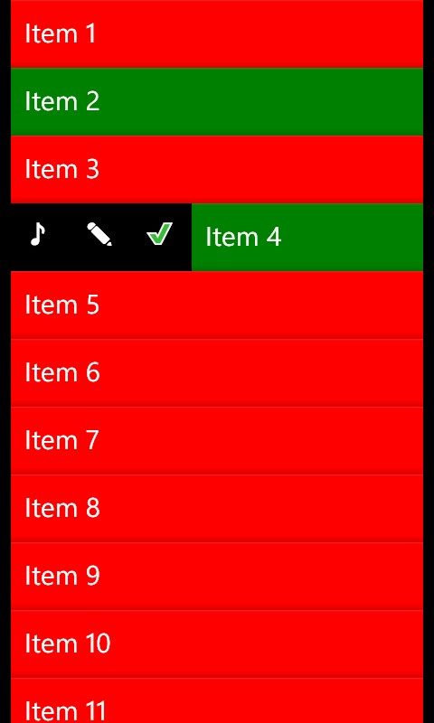

# Swipe Gestures Driven Windows Phone List

=======================================
This project is a swipe gesture driven Windows Phone list application modelled on the Tango iPhone application Swipe gestures on Table View Cell.
I have tried to replicate almost same gestures effects in this application.

## Screenshots:

## Version:
1.0

## Tools Requirements:
Visual Studio 2012

## OS Requirement:
I have tested on Windows Phone 7.5/8.0/8.1 and it works perfect on all.

## Credits:
Special thanks and credit goes to Colin Eberhardt's wonderfull article on this below link. It was starting point for me :)

http://www.codeproject.com/Articles/428088/A-Gesture-Driven-Windows-Phone-To-Do-List

## Contact:
Fee free to contact me :)
Email: Arslan.Pervaiz@outlook.com
